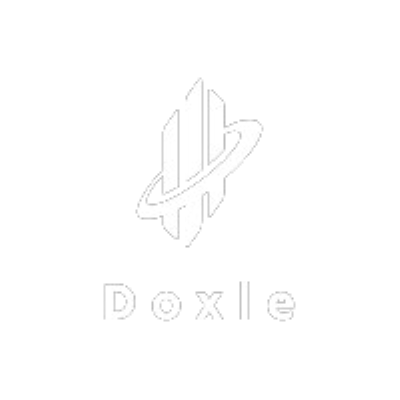

# Doxle 

This project is made for DevStorm hackathon. This is a decentralized web app which can be used to check whether a dcoument with any user is true or not. The documents are issued by an authorized organization itself and cannot be issued by someone else. This provides a sort of signature on the document itself to mark its trueness. Since the document is on the blockchain itself so it cannot be manipulated and no other authority can add a false document to the blockchain. The users cannot write to the blockchain at any cost.


## Features
- The contracts are written in such a way that none other than the true authority itself can write a specific document to the blockchain.

- Documents on the blockchain cannot be manipulated and hance the originality is reserved. This feature also guarantees security of user's personal documents.

- Universal Verification System is provided in order to check whether an document is original or not.
- Verification is done on the basis of existence of it on the blockchain and mapping of the document to user wallet.
- All the loopholes and by-pass to Universal Verification System are taken care of.


## Run Locally

Clone the project

```bash
  git clone https://github.com/varnit-mittal/decentralized_verification.git
```

Go to the project directory

```bash
  cd decentralized_verification
```

Download the dependencies

```bash
  npm i
```

Go to the frontend directory

```bash
  cd frontend
```

Download the dependencies

```bash
  npm i
```

Run the project

```bash
  npm run dev
```

## Deployment

To deploy this project on local blockchain

```bash
  npx hardhat run scripts/deploy.js
```


## Authors

- [@varnit-mittal](https://github.com/varnit-mittal)
- [@aryamanpathak2022](https://github.com/aryamanpathak2022)
- [@ap5967ap](https://github.com/ap5967ap)


## License

[MIT](https://github.com/varnit-mittal/decentralized_verification/blob/main/LICENSE)

